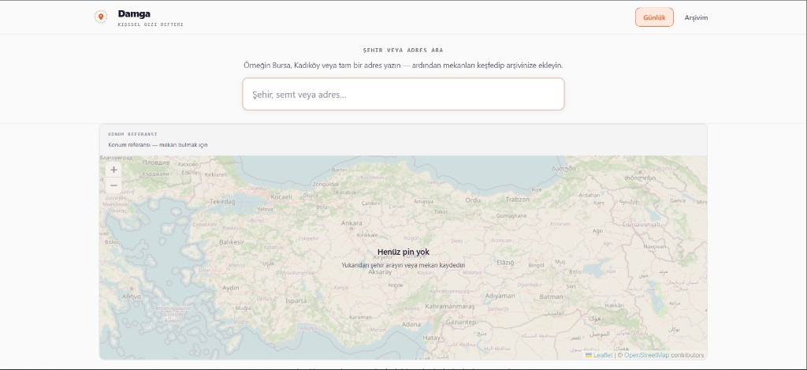

# Damga

Kişisel gezi defteri — bir şehirdeki ilgi çekici yerleri keşfedin, kendi gezi listenizi oluşturun, not alın ve ziyaretlerinizi damgalayın.

**Canlı:** [damga.vercel.app](https://damga.vercel.app)  
**GitHub:** [github.com/aksoyece/damga](https://github.com/aksoyece/damga)



## Temel fikir

Bu projenin amacı yeni bir Google Maps alternatifi oluşturmak **değildir**.

OpenStreetMap ve Nominatim yalnızca şehirdeki veriyi sağlamak için kullanılır. Asıl uygulama değeri, kullanıcının bu veriler üzerine **kendi listesini ve notlarını** oluşturmasından gelir.

Bir kullanıcı birkaç ay sonra uygulamayı açtığında:

- *"Bursa'da hangi yerleri görmek istiyordum?"*
- *"Geçen ay gittiğim ve beğendiğim yerler hangileriydi?"*

sorularının cevabını **kendi verileri** üzerinden görebilmelidir.

Projenin odağı harita değil, **kişisel şehir hafızası**dır.

## Özellikler

- **Konum arama** — Nominatim ile şehir, ilçe, mahalle veya adres arama (debounce + rate limit)
- **Harita** — OpenStreetMap tile’ları, Leaflet ile interaktif harita
- **Mekan keşfi** — Seçilen bölgedeki ilgi noktaları (Overpass API, OSM etiketleri)
- **Kategori filtresi** — Müze, kafe, park vb.; kategoriler OSM verisinden türetilir
- **Kişisel arşiv** — Mekan kaydetme, ziyaret damgası, puan (1–5), not
- **Kalıcılık** — Kullanıcı hesabı yok; veriler `localStorage` içinde saklanır
- **SSR güvenliği** — Depolama işlemleri yalnızca istemci tarafında

## Kullanıcı akışı

1. Uygulama açılır → üstte şehir/adres araması ve harita görünür
2. Kullanıcı örneğin *Bursa* arar → Nominatim sonuçları listelenir
3. Sonuç seçilir → harita konumlanır, bölgedeki mekanlar yüklenir
4. Pin veya kart tıklanır → ad, adres, kategori gösterilir
5. Mekan arşive eklenir → daha sonra ziyaret, puan, not veya kaldırma yapılabilir

## Sayfalar

| Sayfa | Dosya | Açıklama |
|---|---|---|
| Günlük | `pages/index.vue` | Arama, harita, keşif ve son kayıtlar |
| Arşivim | `pages/saved.vue` | Kaydedilen mekanlar, durum filtresi |
| Mekan detayı | `pages/place/[id].vue` | OSM bilgileri + kullanıcı notu, puanı, ziyaret durumu |

## Teknik mimari

| Katman | Açıklama |
|---|---|
| **Harita** | Leaflet + OpenStreetMap standart tile |
| **Arama** | Nominatim (`composables/useNominatim.ts`, `server/api/nominatim/`) |
| **Mekanlar** | Overpass (`server/api/places/nearby.post.ts`) |
| **Dönüşüm** | `types/place.ts` — ham API yanıtı → `Place` / `SavedPlace` |
| **State** | Pinia `stores/places.ts` — `addPlace`, `removePlace`, `updatePlace`, `markAsVisited`, `updateRating`, `updateNote` |
| **Kişisel veri** | Yalnızca tarayıcı `localStorage` (`sehir-hafiza` anahtarı) |

> `server/api/` yalnızca OpenStreetMap servislerine **proxy** görevi görür. Puan, not ve kayıtlı mekanlar sunucuya gönderilmez.

## Veri modelleri

```ts
interface Place {
  id: string
  name: string
  category: string
  latitude: number
  longitude: number
  address?: string
}

interface SavedPlace extends Place {
  status: 'planned' | 'visited'
  rating?: number
  note?: string
  savedAt: string
  visitedAt?: string
}
```

## Proje yapısı

```
components/
├── Map.vue
├── SearchInput.vue
├── PlaceCard.vue
├── PlaceDetails.vue
└── CategoryFilter.vue
composables/
├── useNominatim.ts
└── usePlaces.ts
stores/
└── places.ts
types/
└── place.ts
pages/
├── index.vue
├── saved.vue
└── place/[id].vue
server/api/          # Nominatim & Overpass proxy
```

## Kurulum

```bash
npm install
npm run dev
```

Tarayıcıda `http://localhost:3000` adresini açın.

### Diğer komutlar

```bash
npm run build    # production build
npm run preview  # build sonrası önizleme
```

### Ortam değişkenleri (isteğe bağlı)

| Değişken | Açıklama |
|---|---|
| `NUXT_PUBLIC_SITE_URL` | Canonical site URL (varsayılan: `https://damga.vercel.app`) |

## MVP kapsamı

Task gereksinimlerine göre ilk sürümde şunlar hedeflenmiştir:

- [x] Şehir veya adres aranabilir
- [x] Arama sonucuna göre harita konumlandırılır
- [x] Harita üzerindeki mekanlar görüntülenir
- [x] Mekanlar kategoriye göre filtrelenebilir
- [x] Bir mekan kaydedilebilir
- [x] Kaydedilen mekanlar localStorage'da tutulur
- [x] Mekan ziyaret edildi olarak işaretlenebilir
- [x] Mekana puan ve not eklenebilir
- [x] Kaydedilen mekanlar ayrı bir sayfada görüntülenebilir

## Veri kaynakları

Konum verileri [OpenStreetMap](https://www.openstreetmap.org/) katkıda bulunanlarına aittir. Nominatim ve Overpass kullanım koşullarına uyulmaktadır.

---

© 2026 Damga · Designed & developed by [Ece Aksoy](https://www.linkedin.com/in/eceaksoy16)
